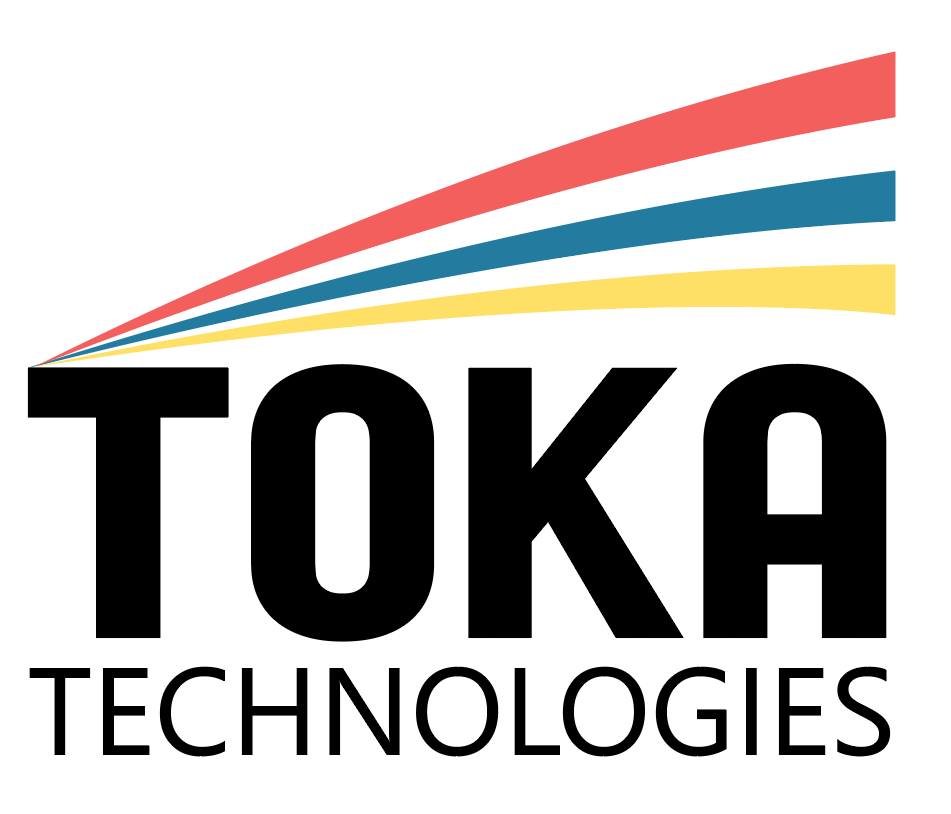

# Toka Technologies
Members: 
| |  |
|--|--|
|  [Lucas Champsaur](https://github.com/LucasEFREI)   a short description of her responsiblity ...| [Thomas Damasse](https://github.com/thomas.damasse@efrei.net)   a short description of his responsiblity ... |

# The Infinity Mitten
 **Description**: Our project consists of a mitten that allows one to control LEDs. By the snap of its fingers and when using the glove, the user of the Infinity Mitten can light up or turn off a LED.
Several other commands are available when wearing the mitten. 
 
[Click here for more information about the project](project) 

Example Video of the porject:

Please don't forget to update the github repository information too. 

# Lab Reports

The lab reports are accessible from [this link](lab)

# Refereces:
