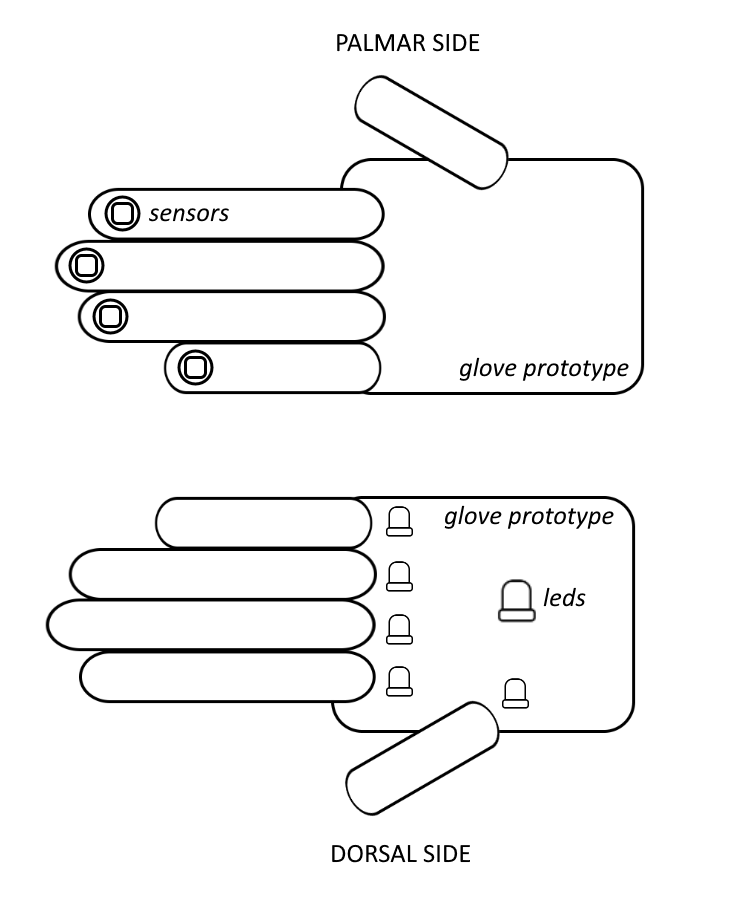

  

# Toka Technologies
Members: 
| |  |
|--|--|
|  [Lucas Champsaur](https://github.com/LucasEFREI)   a short description of her responsiblity ...| [Thomas Damasse](https://github.com/thomas.damasse@efrei.net)   a short description of his responsiblity ... |

# The Infinity Glove
 **Description**: Our project is called The Infinity Glove. 
Our project consists of a glove thaht would allow physically handicaped people (or others) to use everyday technology on their own. By touching one of their fingers with their thumbs, they could access different commands (turn on/off a LED for example). On the dorsal side of the glove, LEDs would turn on when commands are launched in order to give a visual feedback to glove wielder.
For the moment, we just have the proof of concept, so we control two different LEDs with our glove. To control the LEDs, we just have to connect our thumb with another finger on the glove.

 
[Click here for more information about the project](project) 

Example Video of the porject:

# Lab Reports

The lab reports are accessible from [this link](lab)

# Refereces:
