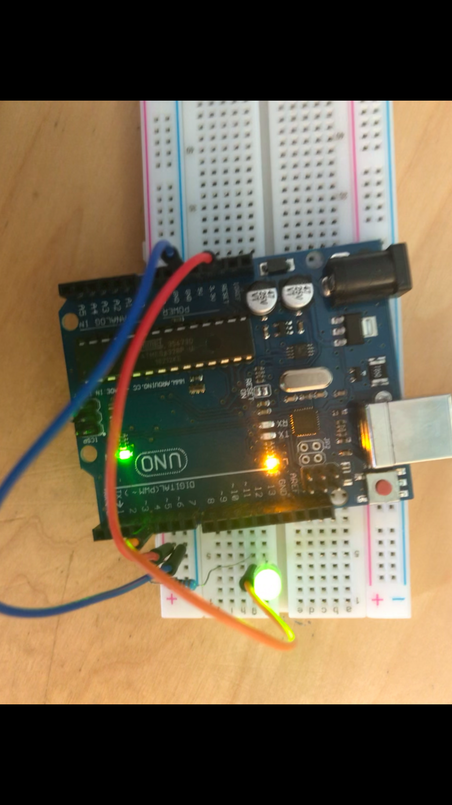
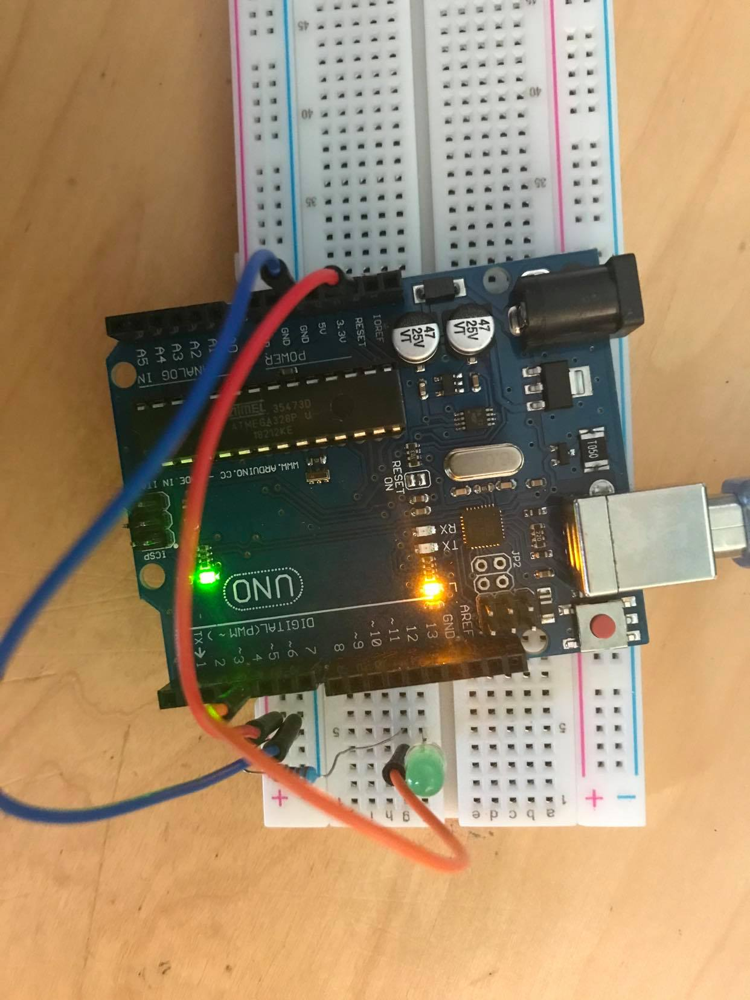

# Exercise 2

In this exercise, we needed to connect a LED to the port 4 of our arduino board and make it turn on using code.

## Code

 ```Arduino
const int led = 4;
 
void setup() {                
  pinMode(led, OUTPUT);     
}
 
void loop() {
  digitalWrite(led, HIGH);     
  delay(1000);                 
  digitalWrite(led, LOW);     
  delay(1000);
}
 ```

## Board Image

Blinking LED:





## Issues

No issues.