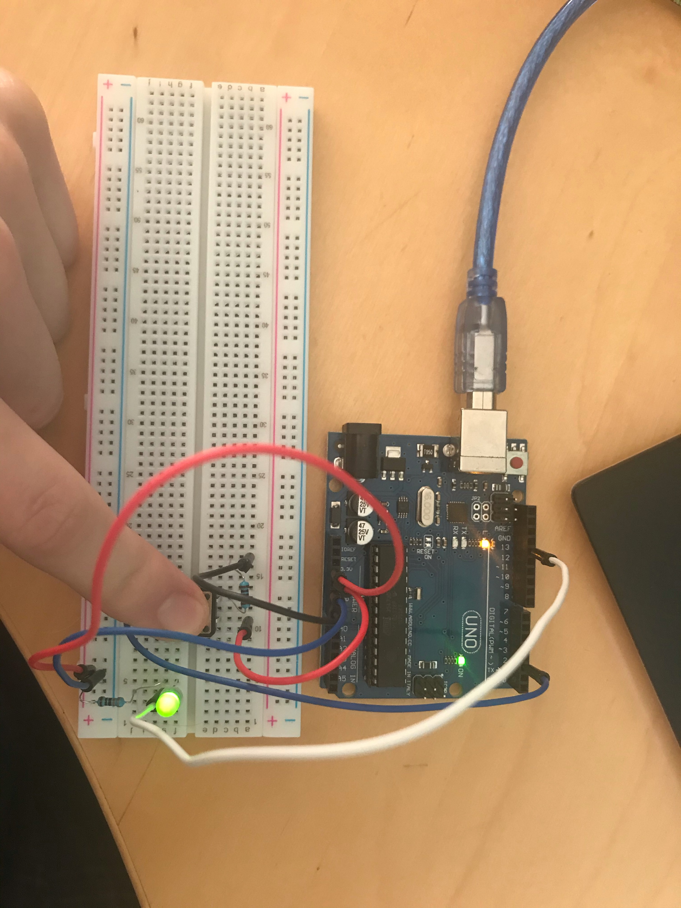
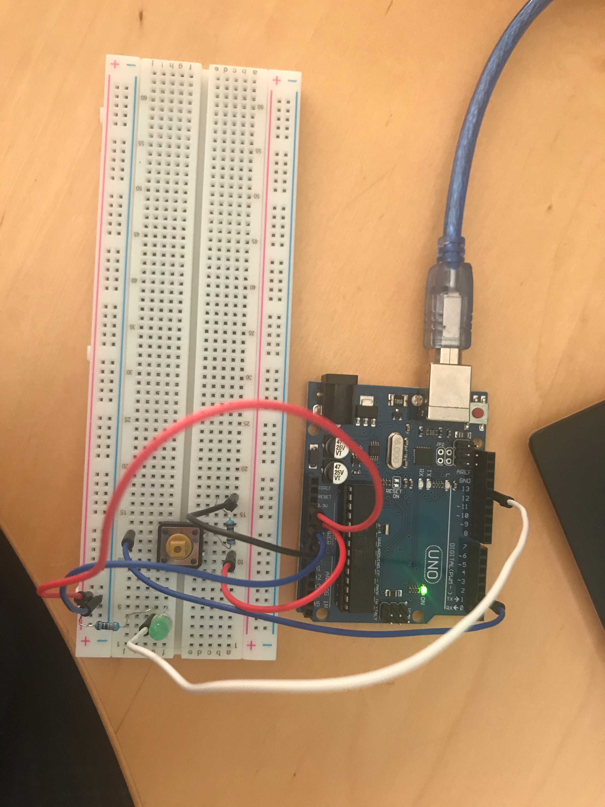

# Exercise 3

In this exercise, we needed to connect a LED to our arduino board and make it turn on using a button and code. 

## Code

 ```Arduino
const int buttonPin = 2;
const int led = 13;
int buttonState = 0;

void setup(){
  pinMode(led, OUTPUT);
  pinMode(buttonPin, INPUT);
}

void loop(){
  buttonState = digitalRead(buttonPin);
  if (buttonState == HIGH)
  {
    digitalWrite(led, HIGH);
  }
  else{
    digitalWrite(led, LOW);
  }
}
 ```

## Board Image

When pressing the button:



When NOT pressing the button:



## Issues

The code wasn't compiling. I disconnected and reconnected my Arduino board to my computer and it worked.