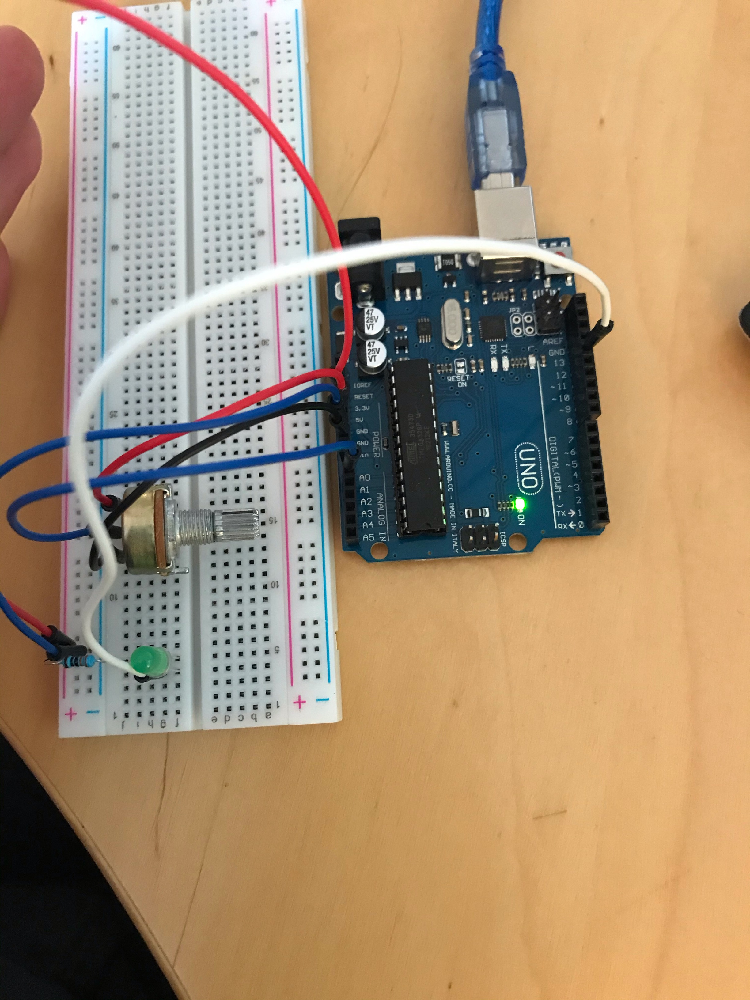
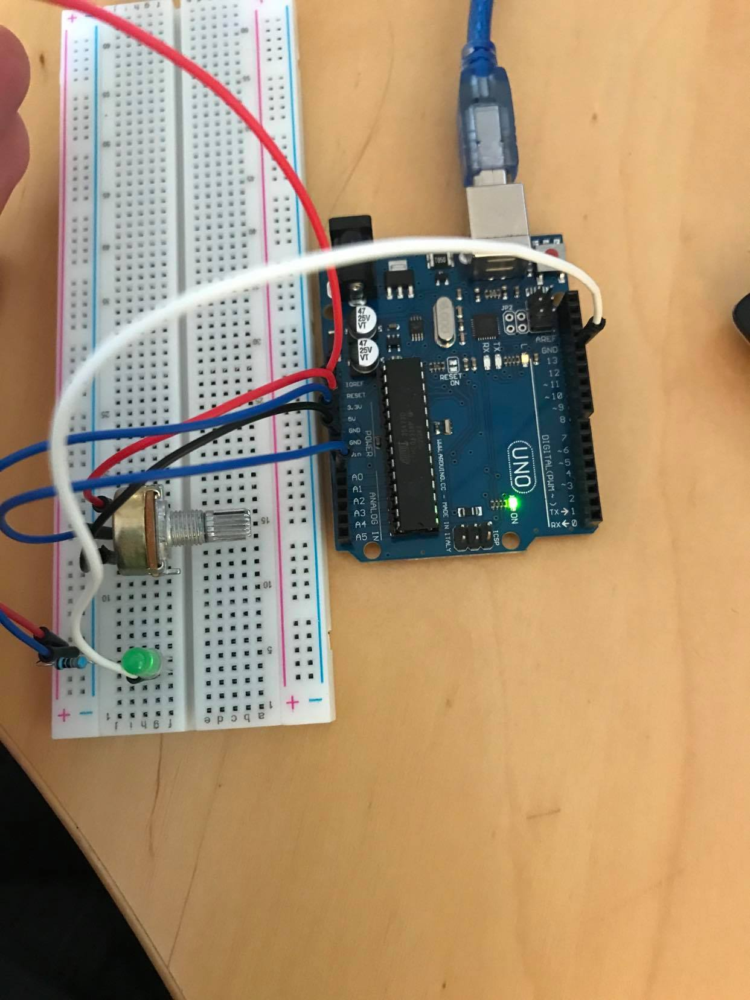

# Exercise 4

In this exercise, we needed to connect a variable resistor (a potentiometer) to our Arduino Board and read its value using one analog input of our Arduino board.

## Code
 ```Arduino
void setup() {
  pinMode(13, OUTPUT);
  pinMode(A0, INPUT);
  Serial.begin(9600);
}

void loop() {
  int sensorValue = analogRead(A0);
  Serial.println(sensorValue);
  digitalWrite(13, HIGH);
  delay(sensorValue);
  digitalWrite(13, LOW);
  delay(sensorValue);
}
 ```


## Board Image

Turned all the way:



Turned a bit:



Print results:


## Issues

I didn't know where to read the values printed by the code at first.
