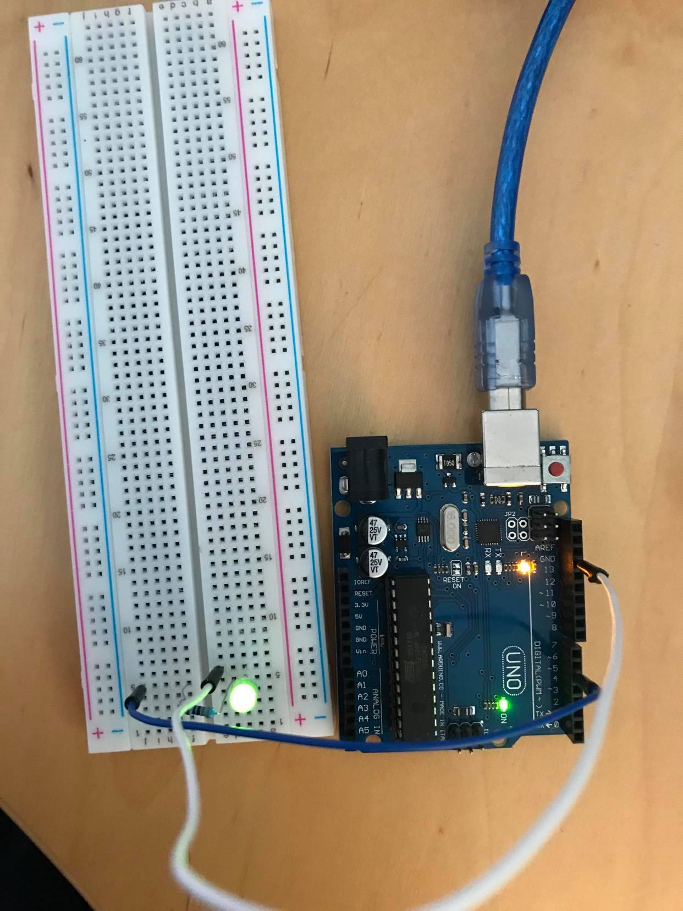
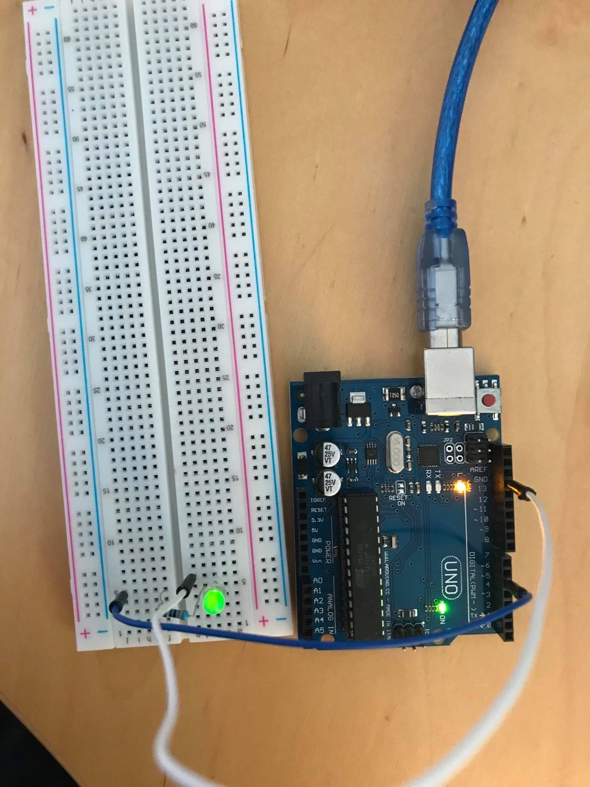

# Exercise 5

In this exercise, we needed to make a LED fade using an analog output and the Pulse Width Modulation technique.

## Code

 ```Arduino
int led = 5;
int brightness = 0;
int fadeAmount = 5;

void setup() {
  pinMode(led, OUTPUT);
}

void loop() {
  analogWrite(led, brightness);
  brightness = brightness + fadeAmount;
  if (brightness <= 0 || brightness >= 255) {
    fadeAmount = -fadeAmount;
  }
  delay(30);
}
 ```

## Board Image

Fading (1):



Fading (2):


Fading (3):




## Issues 

No issues.