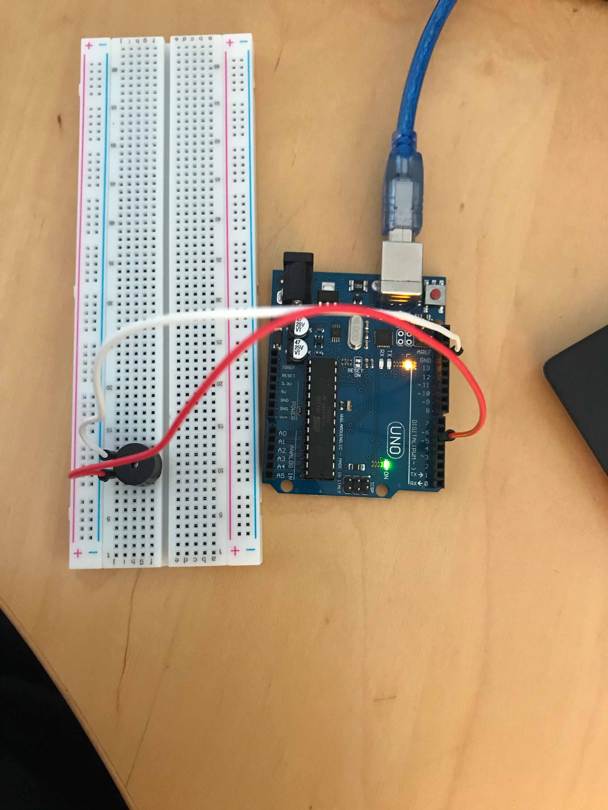

# Exercise 6

In this exercise, we need to connect a buzzer to our Arduino board and make it sounds for 2 seconds repeatedly.

## Code 
 ```Arduino
int buzzer = 5;

void setup() {
  pinMode(buzzer, OUTPUT);
}

void loop() {
  tone(buzzer, 100, 500);
  delay(1000);
  noTone(buzzer);
  delay(1000);
  tone(buzzer, 100, 500);
  delay(1000);
}
 ```

## Board Image



## Issues

No issues.