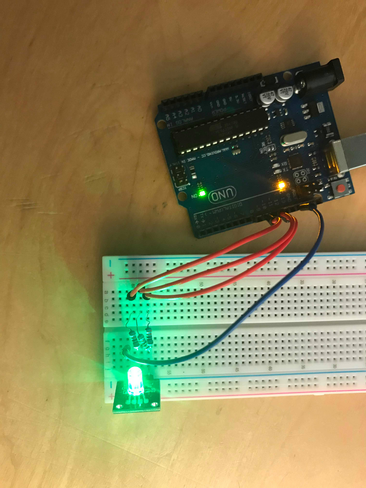
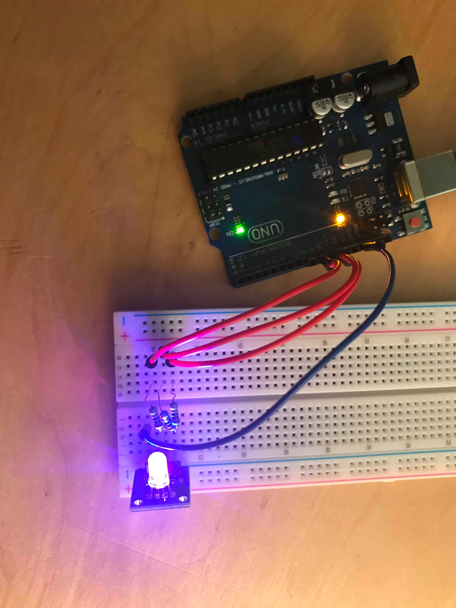
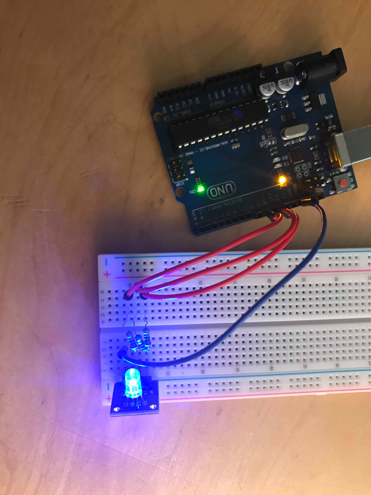
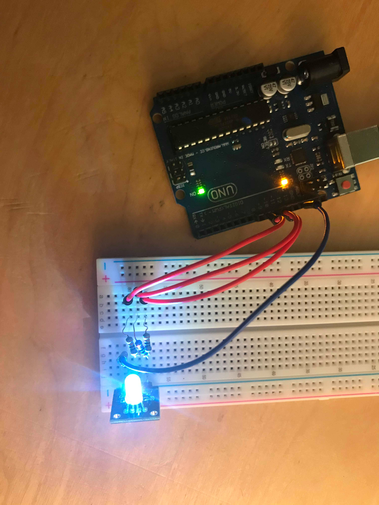
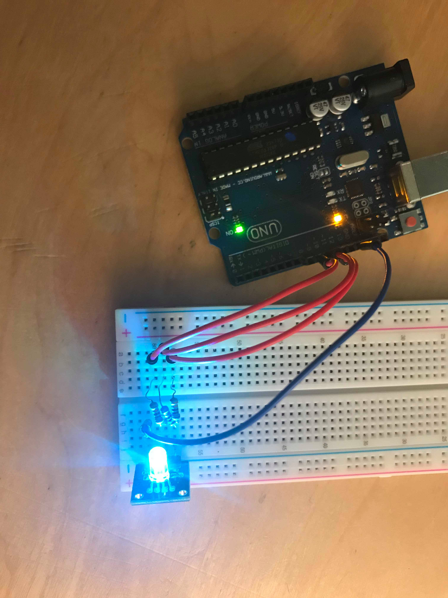
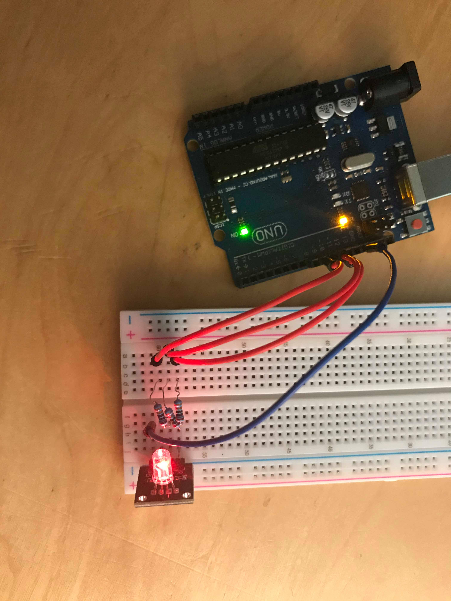
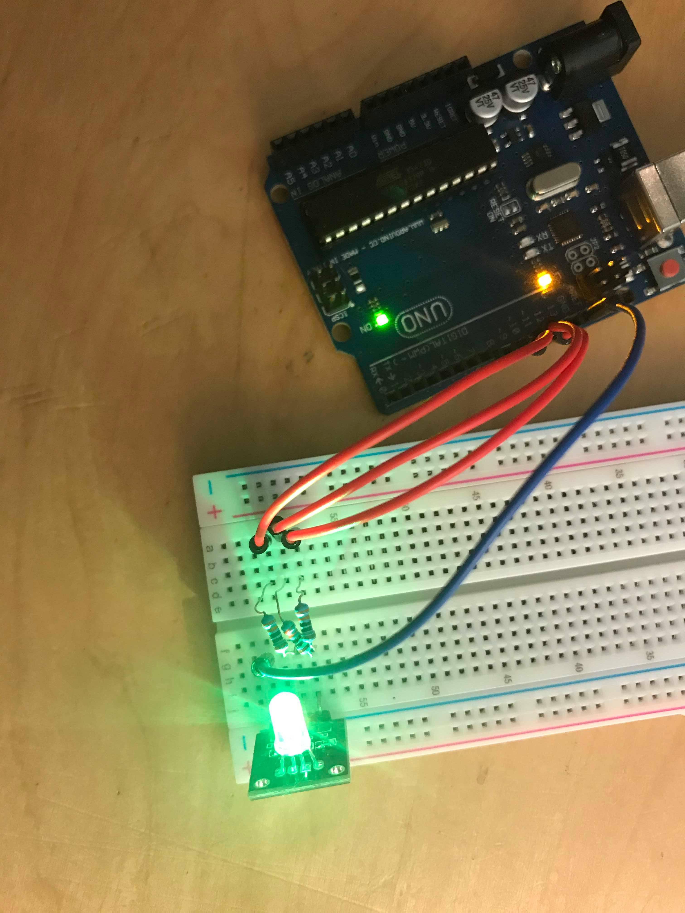

# Exercise 7

In this exercise, we needed to connect a RGB LED to our Arduino board and make it turn different colors with a delay of 1000ms.

## Code 

 ```Arduino
int led1 = 9;
int led2 = 10;
int led3 = 11;

void setup() {
  pinMode(led1, OUTPUT);
  pinMode(led2, OUTPUT);
  pinMode(led3, OUTPUT);
}

void loop() {
  RGB(255, 0, 0);
  delay(1000);
  RGB(255, 255, 0);
  delay(1000);
  RGB(255, 255, 255);
  delay(1000);
  RGB(255, 0, 255);
  delay(1000);
  RGB(0, 255, 0);
  delay(1000);
  RGB(0, 255, 255);
  delay(1000);
  RGB(0, 0, 255);
  delay(1000);
}

void RGB(int led1val, int led2val, int led3val){
  analogWrite(led1, led1val);
  analogWrite(led2, led2val);
  analogWrite(led3, led3val);
}
 ```

## Board Image















## Issues 

No issues.