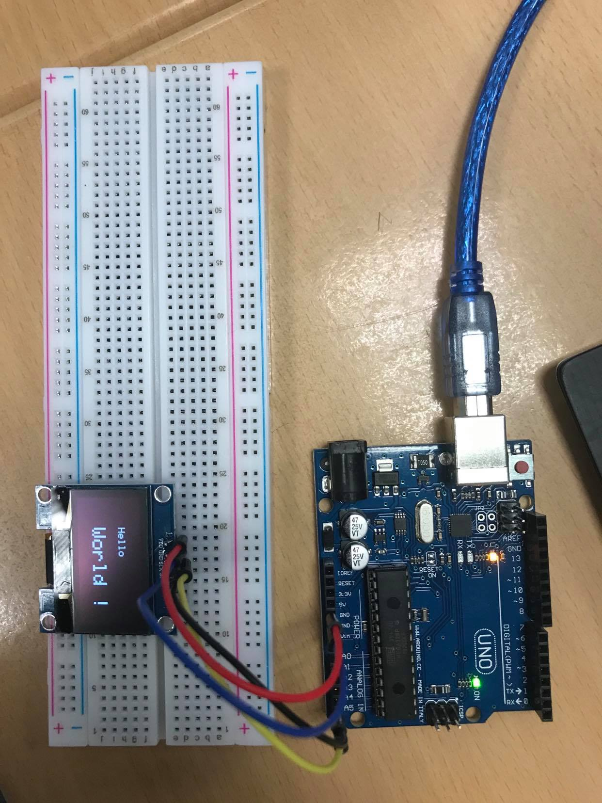

# Exercise 1 
We had to install a library Adafruit SSH1106 to make our OLED Screen work.
We had to remember the schema that we used in the lab 2 to connect our OLED Screen with the breadboard and the arduino.
In order to test our OLED screen, we had to display a "Hello World!" on the screen, and make it blink.
 !

## Code

 ```Arduino
#include <Wire.h>
#include <Adafruit_GFX.h>
#include <Adafruit_SH1106.h>

Adafruit_SH1106 display(23);

void setup()   {
  display.begin();  // initialisation de l'afficheur
  display.clearDisplay(); // ça efface à la fois le buffer et l'écran
}

void loop() {
  display.setCursor(30, 15);  // coordonnées du point de départ du texte
  display.setTextColor(WHITE);
  display.setTextSize(1);  // taille par défaut
  display.println("Hello");
  display.setCursor(30, 25);  // coordonnées du point de départ du texte
  display.setTextSize(2);  // taille double
  display.println("World !");
  display.display();
  delay(1000);
  //
  display.clearDisplay();
  display.display();
  delay(1000);
  // 
}
 ```
  
## Board Image 
  


## Issues

The first libraries we downloaded were not the good ones for our OLED screen. Our screen wasn't displaying anything, either in the right way or not at all.
