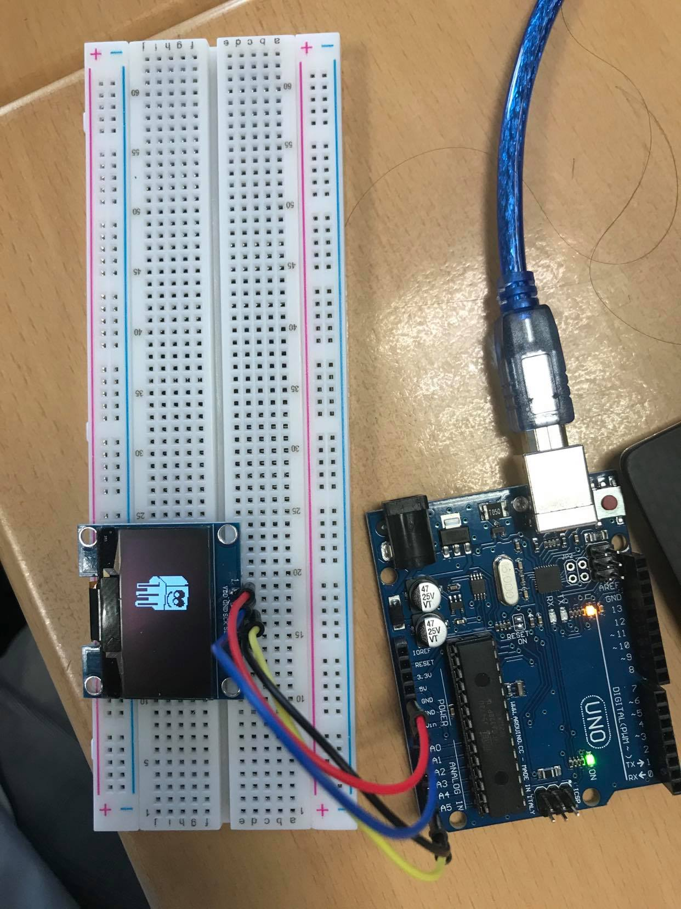
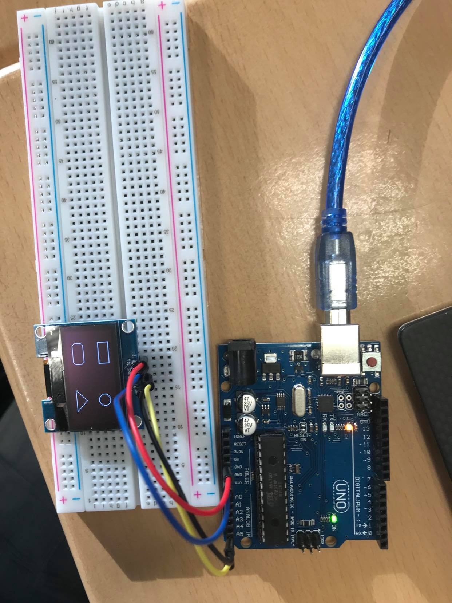

# Exercise 2
We had to work on the code to create some forms and bitmaps on the OLED.
The other library we had to install was the Adafruit GFX Library.

## Code

 ```Arduino
#include <Wire.h>
#include <Adafruit_GFX.h>
#include <Adafruit_SH1106.h>

Adafruit_SH1106 display(23);

const unsigned char myBitmap [] PROGMEM = {
  0x00, 0x00, 0x00, 0x00, 0x00, 0x00, 0x9f, 0xf0, 0x00, 0x00, 0x03, 0x9f, 0xff, 0xe0, 0x00, 0x07,
  0x9f, 0xff, 0xfe, 0x00, 0x0f, 0xdf, 0x0f, 0xbe, 0x00, 0x1f, 0xde, 0x06, 0x0e, 0x00, 0x3f, 0xdc,
  0x04, 0x0e, 0x00, 0x3f, 0xdc, 0x00, 0x06, 0x00, 0x3f, 0xdc, 0x00, 0x06, 0x00, 0x3f, 0xdc, 0x60,
  0x06, 0x00, 0x3f, 0xdc, 0xf1, 0x8e, 0x00, 0x3f, 0xdc, 0xf3, 0xce, 0x00, 0x3f, 0xde, 0x63, 0xde,
  0x00, 0x3f, 0xdf, 0x09, 0x9e, 0x00, 0x3f, 0xdf, 0xfc, 0x7e, 0x00, 0x3f, 0xde, 0x7f, 0xfe, 0x00,
  0x3f, 0xde, 0x7f, 0xf6, 0x00, 0x3f, 0xdf, 0x3f, 0xe6, 0x00, 0x3f, 0xdf, 0x8f, 0x8e, 0x00, 0x3f,
  0xdf, 0xe0, 0x3e, 0x00, 0x3f, 0x00, 0x3f, 0xfe, 0x00, 0x3e, 0xff, 0xc0, 0x1e, 0x00, 0x3d, 0xff,
  0xff, 0xc0, 0x00, 0x3b, 0xff, 0xff, 0xfe, 0x00, 0x37, 0xff, 0xff, 0xfe, 0x00, 0x2f, 0xff, 0xff,
  0xfe, 0x00, 0x0e, 0x1f, 0xff, 0xfe, 0x00, 0x1f, 0x9f, 0x9f, 0xfe, 0x00, 0x3f, 0x9f, 0x9f, 0x9e,
  0x00, 0x3f, 0x9f, 0x9f, 0x9e, 0x00, 0x3f, 0x9f, 0x9f, 0x9e, 0x00, 0x3f, 0x9f, 0x9f, 0x9c, 0x00,
  0x1f, 0x9f, 0x9f, 0x98, 0x00, 0x0f, 0x9f, 0x9f, 0x90, 0x00, 0x07, 0x9f, 0x9f, 0x90, 0x00, 0x00,
  0x9f, 0x9f, 0x90, 0x00, 0x00, 0x9f, 0x91, 0x90, 0x00, 0x00, 0x91, 0x91, 0x90, 0x00, 0x00, 0x91,
  0x91, 0x90, 0x00, 0x00, 0x91, 0x91, 0x90, 0x00, 0x00, 0x91, 0x91, 0x90, 0x00, 0x00, 0x91, 0x91,
  0x90, 0x00, 0x00, 0x91, 0x91, 0x90, 0x00, 0x00, 0x91, 0x91, 0x90, 0x00, 0x00, 0x91, 0x91, 0x90,
  0x00, 0x00, 0xf1, 0xd1, 0x90, 0x00, 0x00, 0x01, 0xc1, 0xf0, 0x00, 0x00, 0x00, 0x00, 0xe0, 0x00
};

void setup()   {
  display.begin();  // initialisation de l'afficheur
  display.clearDisplay(); // ça efface à la fois le buffer et l'écran
}

void loop() {
  display.drawBitmap(30, 10, myBitmap, 34, 48, WHITE);
  display.display();
}
 ```
 ```Arduino
#include <Wire.h>
#include <Adafruit_GFX.h>
#include <Adafruit_SH1106.h>

Adafruit_SH1106 display(23);

void setup()   {
  display.begin();  // initialisation de l'afficheur
  display.clearDisplay(); // ça efface à la fois le buffer et l'écran
}

void loop() {
  display.drawRect( 15, 5, 30, 15, WHITE); // contour d'un rectangle
  display.drawCircle(95, 15, 8, WHITE);  // contour d'un cercle
  display.drawRoundRect(15, 40, 30, 16, 5, WHITE);  // contour d'un rectangle à coins arrondis
  display.drawTriangle(95, 40, 80, 55, 110, 55, WHITE);  // contour d'un triangle
  display.display();
}
 ```
## Board Image 
  




## Issues

No issues.