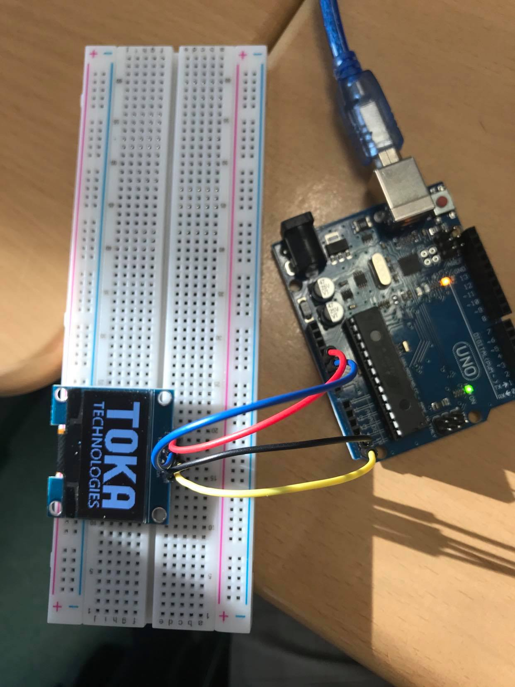

# Exercise 3

The purpose of the exercice was to display our team logo picture on the OLED screen.
We used this [website](https://javl.github.io/image2cpp/), to transform our image into bite array.


# Exercise 2
We had to work on the code to create some forms and bitmaps on the OLED.
The other library we had to install was the Adafruit GFX Library.

## Code

 ```Arduino
#include <Wire.h>
#include <Adafruit_GFX.h>
#include <Adafruit_SH1106.h>

Adafruit_SH1106 display(23);
const unsigned char myBitmap [] PROGMEM = {
  0x00, 0x00, 0x00, 0x00, 0x00, 0x00, 0x00, 0x00, 0x00, 0x00, 0x00, 0x00, 0x00, 0x00, 0x00, 0x00, 
  0x00, 0x00, 0x00, 0x00, 0x00, 0x00, 0x00, 0x00, 0x00, 0x00, 0x00, 0x00, 0x00, 0x00, 0x00, 0x00, 
  0x00, 0x00, 0x00, 0x00, 0x00, 0x00, 0x00, 0x00, 0x00, 0x00, 0x00, 0x00, 0x00, 0x00, 0x00, 0x00, 
  0x00, 0x00, 0x00, 0x00, 0x00, 0x00, 0x00, 0x00, 0x00, 0x00, 0x00, 0x00, 0x00, 0x00, 0x00, 0x00, 
  0x1f, 0xff, 0xff, 0xff, 0x00, 0x7f, 0xfc, 0x00, 0x7f, 0xc0, 0x07, 0xfe, 0x00, 0x7f, 0xfc, 0x00, 
  0x1f, 0xff, 0xff, 0xff, 0x01, 0xff, 0xff, 0x00, 0x7f, 0xc0, 0x0f, 0xfc, 0x01, 0xff, 0xff, 0x00, 
  0x1f, 0xff, 0xff, 0xff, 0x03, 0xff, 0xff, 0x80, 0x7f, 0xc0, 0x0f, 0xf8, 0x03, 0xff, 0xff, 0x80, 
  0x1f, 0xff, 0xff, 0xff, 0x07, 0xff, 0xff, 0xc0, 0x7f, 0xc0, 0x1f, 0xf0, 0x07, 0xff, 0xff, 0xc0, 
  0x1f, 0xff, 0xff, 0xff, 0x0f, 0xff, 0xff, 0xe0, 0x7f, 0xc0, 0x3f, 0xe0, 0x0f, 0xff, 0xff, 0xe0, 
  0x1f, 0xff, 0xff, 0xff, 0x0f, 0xff, 0xff, 0xf0, 0x7f, 0xc0, 0x7f, 0xc0, 0x0f, 0xff, 0xff, 0xe0, 
  0x1f, 0xff, 0xff, 0xff, 0x1f, 0xfc, 0x7f, 0xf0, 0x7f, 0xc0, 0xff, 0x80, 0x1f, 0xfc, 0x7f, 0xf0, 
  0x00, 0x07, 0xfc, 0x00, 0x1f, 0xf8, 0x1f, 0xf0, 0x7f, 0xc0, 0xff, 0x80, 0x1f, 0xf0, 0x3f, 0xf0, 
  0x00, 0x07, 0xfc, 0x00, 0x1f, 0xf0, 0x1f, 0xf0, 0x7f, 0xc1, 0xff, 0x00, 0x1f, 0xf0, 0x1f, 0xf0, 
  0x00, 0x07, 0xfc, 0x00, 0x1f, 0xf0, 0x1f, 0xf8, 0x7f, 0xc3, 0xfe, 0x00, 0x1f, 0xf0, 0x1f, 0xf0, 
  0x00, 0x07, 0xfc, 0x00, 0x1f, 0xf0, 0x1f, 0xf8, 0x7f, 0xc7, 0xfc, 0x00, 0x1f, 0xe0, 0x1f, 0xf0, 
  0x00, 0x07, 0xfc, 0x00, 0x1f, 0xf0, 0x1f, 0xf8, 0x7f, 0xcf, 0xf8, 0x00, 0x1f, 0xe0, 0x1f, 0xf0, 
  0x00, 0x07, 0xfc, 0x00, 0x1f, 0xf0, 0x1f, 0xf8, 0x7f, 0xcf, 0xf0, 0x00, 0x1f, 0xe0, 0x1f, 0xf0, 
  0x00, 0x07, 0xfc, 0x00, 0x1f, 0xf0, 0x1f, 0xf8, 0x7f, 0xff, 0xf0, 0x00, 0x1f, 0xe0, 0x1f, 0xf0, 
  0x00, 0x07, 0xfc, 0x00, 0x1f, 0xf0, 0x1f, 0xf8, 0x7f, 0xff, 0xe0, 0x00, 0x1f, 0xe0, 0x1f, 0xf0, 
  0x00, 0x07, 0xfc, 0x00, 0x1f, 0xf0, 0x1f, 0xf8, 0x7f, 0xff, 0xc0, 0x00, 0x1f, 0xe0, 0x1f, 0xf0, 
  0x00, 0x07, 0xfc, 0x00, 0x1f, 0xf0, 0x1f, 0xf8, 0x7f, 0xff, 0xc0, 0x00, 0x1f, 0xe0, 0x1f, 0xf0, 
  0x00, 0x07, 0xfc, 0x00, 0x1f, 0xf0, 0x1f, 0xf8, 0x7f, 0xff, 0xe0, 0x00, 0x1f, 0xe0, 0x1f, 0xf0, 
  0x00, 0x07, 0xfc, 0x00, 0x1f, 0xf0, 0x1f, 0xf8, 0x7f, 0xff, 0xf0, 0x00, 0x1f, 0xe0, 0x1f, 0xf0, 
  0x00, 0x07, 0xfc, 0x00, 0x1f, 0xf0, 0x1f, 0xf8, 0x7f, 0xff, 0xf0, 0x00, 0x1f, 0xe0, 0x1f, 0xf0, 
  0x00, 0x07, 0xfc, 0x00, 0x1f, 0xf0, 0x1f, 0xf8, 0x7f, 0xff, 0xf8, 0x00, 0x1f, 0xf0, 0x1f, 0xf0, 
  0x00, 0x07, 0xfc, 0x00, 0x1f, 0xf0, 0x1f, 0xf8, 0x7f, 0xff, 0xfc, 0x00, 0x1f, 0xff, 0xff, 0xf0, 
  0x00, 0x07, 0xfc, 0x00, 0x1f, 0xf0, 0x1f, 0xf8, 0x7f, 0xf7, 0xfc, 0x00, 0x1f, 0xff, 0xff, 0xf0, 
  0x00, 0x07, 0xfc, 0x00, 0x1f, 0xf0, 0x1f, 0xf8, 0x7f, 0xe3, 0xfe, 0x00, 0x1f, 0xff, 0xff, 0xf0, 
  0x00, 0x07, 0xfc, 0x00, 0x1f, 0xf0, 0x1f, 0xf8, 0x7f, 0xe3, 0xfe, 0x00, 0x1f, 0xff, 0xff, 0xf0, 
  0x00, 0x07, 0xfc, 0x00, 0x1f, 0xf0, 0x1f, 0xf8, 0x7f, 0xc1, 0xff, 0x00, 0x1f, 0xff, 0xff, 0xf0, 
  0x00, 0x07, 0xfc, 0x00, 0x1f, 0xf0, 0x1f, 0xf8, 0x7f, 0xc1, 0xff, 0x80, 0x1f, 0xff, 0xff, 0xf0, 
  0x00, 0x07, 0xfc, 0x00, 0x1f, 0xf0, 0x1f, 0xf8, 0x7f, 0xc0, 0xff, 0x80, 0x1f, 0xff, 0xff, 0xf0, 
  0x00, 0x07, 0xfc, 0x00, 0x1f, 0xf0, 0x1f, 0xf8, 0x7f, 0xc0, 0x7f, 0xc0, 0x1f, 0xe0, 0x1f, 0xf0, 
  0x00, 0x07, 0xfc, 0x00, 0x1f, 0xf0, 0x1f, 0xf0, 0x7f, 0xc0, 0x7f, 0xe0, 0x1f, 0xe0, 0x1f, 0xf0, 
  0x00, 0x07, 0xfc, 0x00, 0x1f, 0xf8, 0x1f, 0xf0, 0x7f, 0xc0, 0x3f, 0xe0, 0x1f, 0xe0, 0x1f, 0xf0, 
  0x00, 0x07, 0xfc, 0x00, 0x1f, 0xfc, 0x7f, 0xf0, 0x7f, 0xc0, 0x3f, 0xf0, 0x1f, 0xe0, 0x1f, 0xf0, 
  0x00, 0x07, 0xfc, 0x00, 0x0f, 0xff, 0xff, 0xf0, 0x7f, 0xc0, 0x1f, 0xf0, 0x1f, 0xe0, 0x1f, 0xf0, 
  0x00, 0x07, 0xfc, 0x00, 0x0f, 0xff, 0xff, 0xe0, 0x7f, 0xc0, 0x1f, 0xf8, 0x1f, 0xe0, 0x1f, 0xf0, 
  0x00, 0x07, 0xfc, 0x00, 0x07, 0xff, 0xff, 0xc0, 0x7f, 0xc0, 0x0f, 0xfc, 0x1f, 0xe0, 0x1f, 0xf0, 
  0x00, 0x07, 0xfc, 0x00, 0x03, 0xff, 0xff, 0x80, 0x7f, 0xc0, 0x07, 0xfc, 0x1f, 0xe0, 0x1f, 0xf0, 
  0x00, 0x07, 0xfc, 0x00, 0x00, 0xff, 0xff, 0x00, 0x7f, 0xc0, 0x07, 0xfe, 0x1f, 0xe0, 0x1f, 0xf0, 
  0x00, 0x07, 0xfc, 0x00, 0x00, 0x3f, 0xfc, 0x00, 0x7f, 0xc0, 0x03, 0xff, 0x1f, 0xe0, 0x1f, 0xf0, 
  0x00, 0x00, 0x00, 0x00, 0x00, 0x03, 0x80, 0x00, 0x00, 0x00, 0x00, 0x00, 0x00, 0x00, 0x00, 0x00, 
  0x00, 0x00, 0x00, 0x00, 0x00, 0x00, 0x00, 0x00, 0x00, 0x00, 0x00, 0x00, 0x00, 0x00, 0x00, 0x00, 
  0x00, 0x00, 0x00, 0x00, 0x00, 0x00, 0x00, 0x00, 0x00, 0x00, 0x00, 0x00, 0x00, 0x00, 0x00, 0x00, 
  0x00, 0x00, 0x00, 0x00, 0x00, 0x00, 0x00, 0x00, 0x00, 0x00, 0x00, 0x00, 0x00, 0x00, 0x00, 0x00, 
  0x0f, 0xf3, 0xf0, 0x3e, 0x60, 0x63, 0x03, 0x03, 0xc0, 0xc0, 0x3e, 0x00, 0xf8, 0xc7, 0xe0, 0xf0, 
  0x0f, 0xf3, 0xf0, 0xf6, 0x60, 0x63, 0x83, 0x0e, 0xf0, 0xc0, 0x77, 0x03, 0xdc, 0xc7, 0xe3, 0xb0, 
  0x01, 0x83, 0x01, 0x80, 0x60, 0x63, 0x83, 0x18, 0x18, 0xc0, 0xc1, 0x86, 0x00, 0xc6, 0x02, 0x00, 
  0x01, 0x83, 0x01, 0x00, 0x60, 0x63, 0xc3, 0x10, 0x08, 0xc1, 0x80, 0xc4, 0x00, 0xc6, 0x06, 0x00, 
  0x01, 0x83, 0x03, 0x00, 0x60, 0x63, 0x63, 0x30, 0x0c, 0xc1, 0x00, 0x4c, 0x00, 0xc6, 0x03, 0x00, 
  0x01, 0x83, 0xf3, 0x00, 0x7f, 0xe3, 0x63, 0x30, 0x0c, 0xc1, 0x00, 0x4c, 0x00, 0xc7, 0xe3, 0x80, 
  0x01, 0x83, 0xf3, 0x00, 0x7f, 0xe3, 0x33, 0x30, 0x0c, 0xc1, 0x00, 0x48, 0x3c, 0xc7, 0xe0, 0xe0, 
  0x01, 0x83, 0x03, 0x00, 0x60, 0x63, 0x13, 0x30, 0x0c, 0xc1, 0x00, 0x4c, 0x0c, 0xc6, 0x00, 0x30, 
  0x01, 0x83, 0x03, 0x00, 0x60, 0x63, 0x1b, 0x30, 0x08, 0xc1, 0x80, 0xcc, 0x0c, 0xc6, 0x00, 0x18, 
  0x01, 0x83, 0x01, 0x00, 0x60, 0x63, 0x0f, 0x18, 0x18, 0xc1, 0x80, 0xc4, 0x0c, 0xc6, 0x00, 0x18, 
  0x01, 0x83, 0x01, 0x80, 0x60, 0x63, 0x07, 0x1c, 0x30, 0xc0, 0xc1, 0x86, 0x0c, 0xc6, 0x04, 0x18, 
  0x01, 0x83, 0xf8, 0xfe, 0x60, 0x63, 0x07, 0x0f, 0xe0, 0xfc, 0x7f, 0x03, 0xfc, 0xc7, 0xf7, 0xf0, 
  0x00, 0x00, 0x00, 0x00, 0x00, 0x00, 0x00, 0x01, 0x00, 0x00, 0x08, 0x00, 0x40, 0x00, 0x00, 0x80, 
  0x00, 0x00, 0x00, 0x00, 0x00, 0x00, 0x00, 0x00, 0x00, 0x00, 0x00, 0x00, 0x00, 0x00, 0x00, 0x00, 
  0x00, 0x00, 0x00, 0x00, 0x00, 0x00, 0x00, 0x00, 0x00, 0x00, 0x00, 0x00, 0x00, 0x00, 0x00, 0x00, 
  0x00, 0x00, 0x00, 0x00, 0x00, 0x00, 0x00, 0x00, 0x00, 0x00, 0x00, 0x00, 0x00, 0x00, 0x00, 0x00, 
  0x00, 0x00, 0x00, 0x00, 0x00, 0x00, 0x00, 0x00, 0x00, 0x00, 0x00, 0x00, 0x00, 0x00, 0x00, 0x00, 
  0x00, 0x00, 0x00, 0x00, 0x00, 0x00, 0x00, 0x00, 0x00, 0x00, 0x00, 0x00, 0x00, 0x00, 0x00, 0x00
};

void setup()   {
  display.begin(); 
  display.clearDisplay(); 
}

void loop() {
  display.drawBitmap(0, 0, myBitmap, 128, 64, WHITE);
  display.display();
}
 ```
## Board Image 
  


## Issues

No issues.