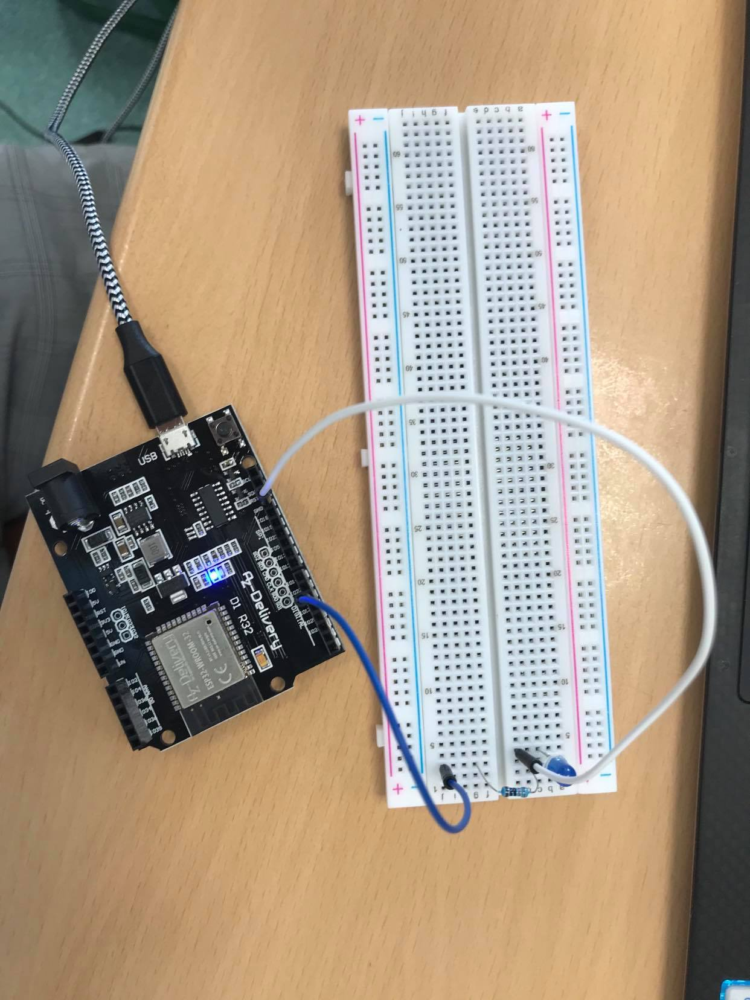
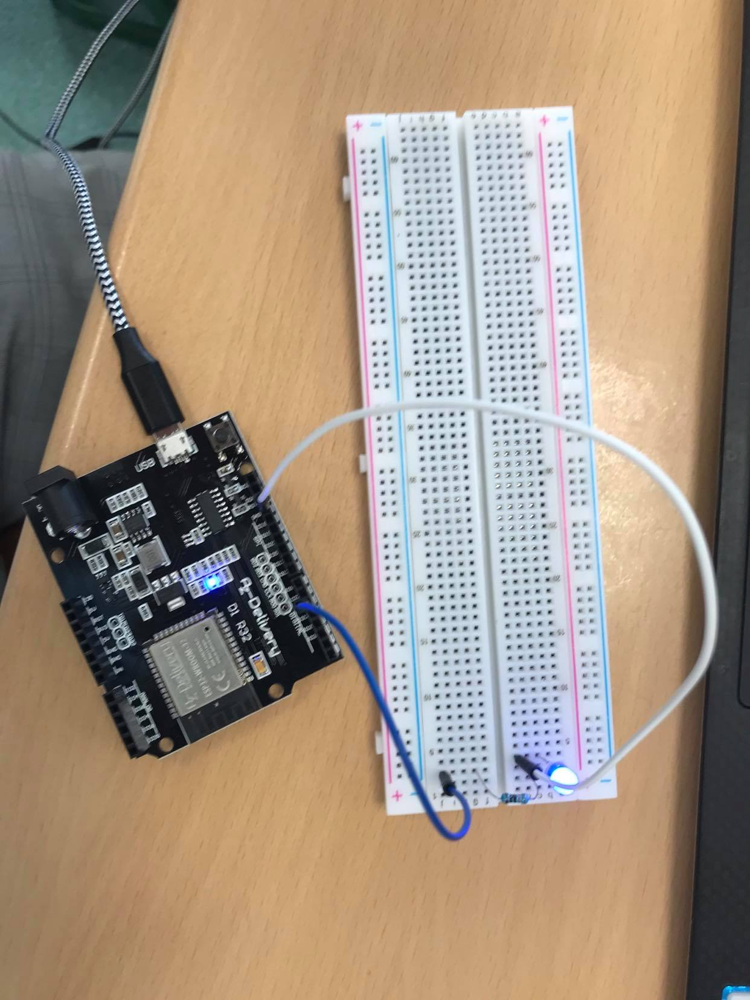

# Exercise 1 

We used our previous code that we used in the lab 1 for blinking a LED. We adapted it with the ESP32.
The circuit montage had to be modified to work with the ESP32.

## Code

 ```Arduino
const int led = 16;

void setup() {                
 pinMode(led, OUTPUT);     
}

void loop() {
 digitalWrite(led, HIGH);     
 delay(1000);                 
 digitalWrite(led, LOW);     
 delay(1000);
}
 ```
  
## Board Image 
  




## Issues

No issues.
