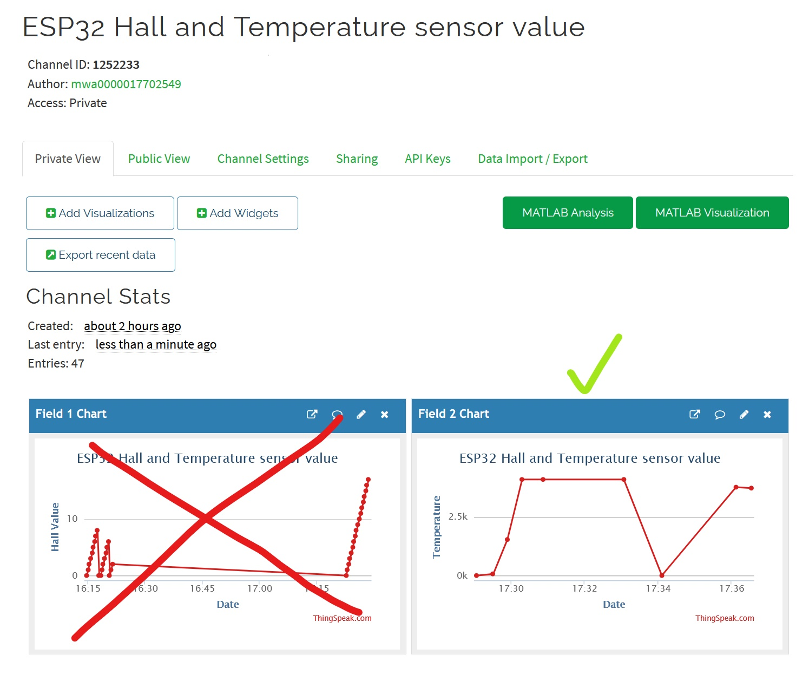
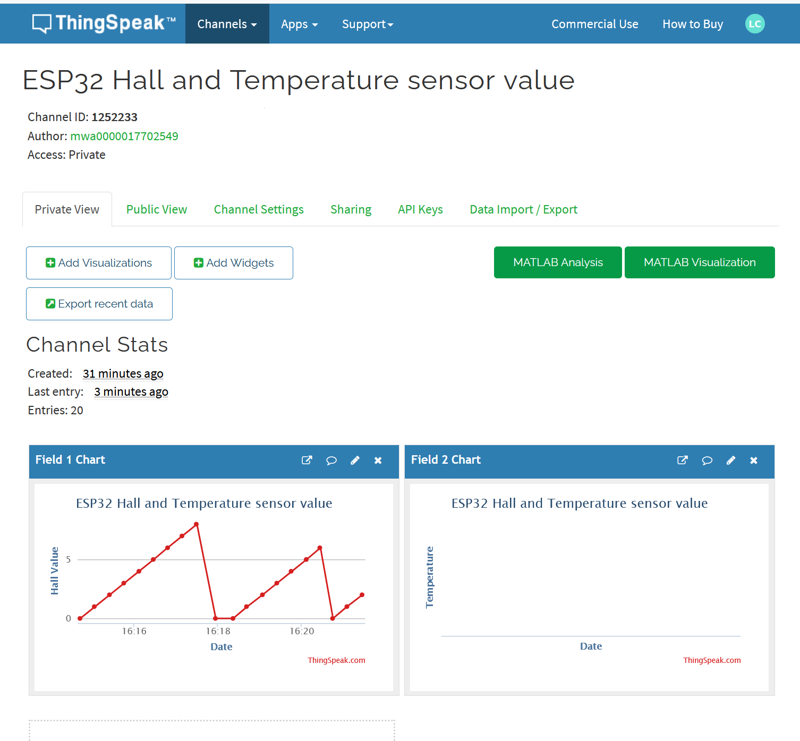

# Exercise 3

We used our previous code that we used in the lab 1 to read an analog value. We adapted it with the ESP32.
The circuit montage had to be modified to work with the ESP32.

## Code

Main code:
 
 ```Arduino
/*
  WriteSingleField
  
  Description: Writes a value to a channel on ThingSpeak every 20 seconds.
  
  Hardware: ESP32 based boards
  
  !!! IMPORTANT - Modify the secrets.h file for this project with your network connection and ThingSpeak channel details. !!!
  
  Note:
  - Requires installation of EPS32 core. See https://github.com/espressif/arduino-esp32/blob/master/docs/arduino-ide/boards_manager.md for details. 
  - Select the target hardware from the Tools->Board menu
  - This example is written for a network using WPA encryption. For WEP or WPA, change the WiFi.begin() call accordingly.
  
  ThingSpeak ( https://www.thingspeak.com ) is an analytic IoT platform service that allows you to aggregate, visualize, and 
  analyze live data streams in the cloud. Visit https://www.thingspeak.com to sign up for a free account and create a channel.  
  
  Documentation for the ThingSpeak Communication Library for Arduino is in the README.md folder where the library was installed.
  See https://www.mathworks.com/help/thingspeak/index.html for the full ThingSpeak documentation.
  
  For licensing information, see the accompanying license file.
  
  Copyright 2018, The MathWorks, Inc.
*/

#include "ThingSpeak.h"
#include "secrets.h"
#include <WiFi.h>

char ssid[] = SECRET_SSID;   // your network SSID (name) 
char pass[] = SECRET_PASS;   // your network password
int keyIndex = 0;            // your network key Index number (needed only for WEP)
WiFiClient  client;

unsigned long myChannelNumber = SECRET_CH_ID;
const char * myWriteAPIKey = SECRET_WRITE_APIKEY;

int number = 0;

void setup() {
  Serial.begin(115200);  //Initialize serial

  WiFi.mode(WIFI_STA);   
  ThingSpeak.begin(client);  // Initialize ThingSpeak
}
int analogpin = 39;

void loop() {

  // Connect or reconnect to WiFi
  if(WiFi.status() != WL_CONNECTED){
    Serial.print("Attempting to connect to SSID: ");
    Serial.println(SECRET_SSID);
    while(WiFi.status() != WL_CONNECTED){
      WiFi.begin(ssid, pass); // Connect to WPA/WPA2 network. Change this line if using open or WEP network
      Serial.print(".");
      delay(5000);     
    } 
    Serial.println("\nConnected.");
  }

  // Write to ThingSpeak. There are up to 8 fields in a channel, allowing you to store up to 8 different
  // pieces of information in a channel.  Here, we write to field 1.
  int x = ThingSpeak.writeField(myChannelNumber, 2, number, myWriteAPIKey);
  if(x == 200){
    Serial.println("Channel update successful.");
  }
  else{
    Serial.println("Problem updating channel. HTTP error code " + String(x));
  }
  
  // change the value
  number= analogRead(analogpin);
  
  delay(5000); // Wait 20 seconds to update the channel again
}
 ```

Secret.h file:  

 ```Arduino
// Use this file to store all of the private credentials 
// and connection details

#define SECRET_SSID "Honor Toto"		// replace MySSID with your WiFi network name
#define SECRET_PASS "superkaka"	// replace MyPassword with your WiFi password

#define SECRET_CH_ID 1252233			// replace 0000000 with your channel number
#define SECRET_WRITE_APIKEY "T7ID06CYG09B92CK"   // replace XYZ with your channel write API Key
 ```
  
## Results
  


## Issues

At first, we weren't getting the good values. 

